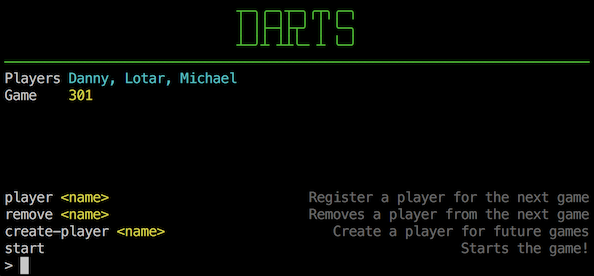
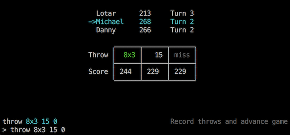

# Dartscore

A terminal based scorekeeper for darts.




### Database Setup

```
createuser darts --superuser --password
# when prompted, the password is 'darts'

createdb -Udarts darts
psql -Udarts darts -f schema/01_init.sql
```

### Local Setup

Requires Racket v6.7+

```
raco pkg install charterm
raco pkg install rackunit-chk
```

### Running

```
# Interpreted:
racket main.rkt

# Compiled:
raco exe main.rkt
./main
```
